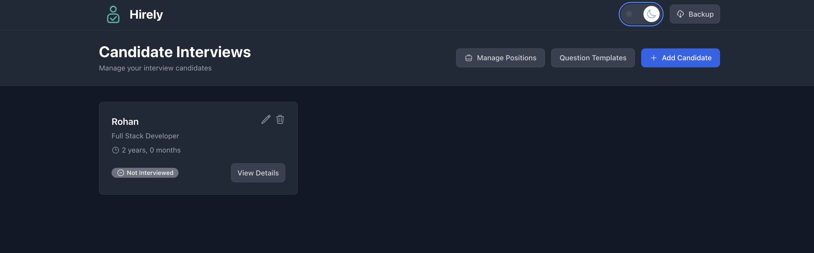

# Hirely - Candidate Interview Management App

A modern, responsive web application for managing candidate interviews and questions. Built with React, TypeScript, and Tailwind CSS with full dark theme support.

## ✨ Features

### 🏠 Home Page (Candidate List)
- **Candidate Cards** with full name, position, status, and experience
- **Status Management**: Not Interviewed (grey), Passed (green), Rejected (red), Maybe (yellow-orange)
- **Add Candidate** with modal form
- **Manage Positions** with add/remove functionality
- **Delete Candidates** with confirmation dialog
- **View Summary** button for candidates with completed interviews
- **Dark Theme** toggle with persistent preference

### 👤 Candidate Detail Page
- **Question Management**: Add, edit, and delete questions
- **Section Organization**: Group questions by sections
- **Answer Tracking**: Record candidate answers
- **Scoring System**: Mark questions as correct/wrong with undo functionality
- **Auto-sorting**: Questions automatically move to "Correct Answers" or "Wrong/Unanswered" sections
- **Statistics Bar**: Real-time counters for correct, wrong, and remaining questions
- **Save Interview Result**: Finalize interview with description and result
- **Result Summary**: View detailed interview summary with copy functionality
- **Dark Theme** support throughout the interface

### 📋 Question Templates
- **Template Management**: Create and manage reusable question templates
- **Section Organization**: Add sections within templates
- **Question Bank**: Build a library of questions by section
- **Import Functionality**: Import questions from templates when adding candidates

### 💾 Data Management & Backup
- **Automatic Backups**: Data is automatically backed up to localStorage
- **Manual Backups**: Create manual backups anytime
- **Data Export**: Export all data as JSON files for external storage
- **Data Import**: Import data from previously exported JSON files
- **Restore Functionality**: Restore from local backups
- **Cross-device Support**: Export/import allows data transfer between devices

## 📸 Screenshots

### Light Theme


### Dark Theme



## 🛠️ Tech Stack

- **React 18** with TypeScript
- **React Router** for navigation
- **Tailwind CSS** for styling and responsiveness
- **Heroicons** for beautiful icons
- **IndexedDB** for robust data persistence
- **LocalStorage** for backup storage
- **Mobile-first** responsive design
- **Dark Theme** support with CSS custom properties

## 🚀 Getting Started

### Prerequisites
- Node.js (v14 or higher)
- npm or yarn

### Installation

1. Clone the repository:
```bash
git clone <repository-url>
cd interview-app
```

2. Install dependencies:
```bash
npm install
```

3. Start the development server:
```bash
npm start
```

4. Open [http://localhost:3000](http://localhost:3000) to view it in the browser.

## 🚀 Production Deployment with PM2

This guide covers deploying the application using PM2 on Windows, Linux, and macOS.

### Prerequisites for Production
- Node.js (v14 or higher)
- npm or yarn
- PM2 (will be installed globally)

### Step 1: Build the Application

First, create a production build:

```bash
npm run build
```

This creates an optimized production build in the `build/` directory.

### Step 2: Install PM2

Install PM2 globally on your system:

```bash
npm install -g pm2
```

### Step 3: Install Serve Package

Install the serve package for serving static files:

```bash
npm install serve
```

### Step 4: Deploy with PM2

#### Option A: Quick Start (All Platforms)

```bash
# Start the application
pm2 start "npx serve -s build -l 3000" --name "hirely-interview-app"

# Save PM2 configuration
pm2 save

# Set PM2 to start on system boot
pm2 startup
```

#### Option B: Using Ecosystem File (Recommended)

The project includes an `ecosystem.config.js` file. Use it for more control:

```bash
# Start using ecosystem file
pm2 start ecosystem.config.js

# Save configuration
pm2 save

# Set PM2 to start on system boot
pm2 startup
```

### Platform-Specific Instructions

#### 🪟 Windows Deployment

1. **Install Node.js and npm** (if not already installed):
   - Download from [nodejs.org](https://nodejs.org/)
   - Verify installation: `node --version` and `npm --version`

2. **Open Command Prompt or PowerShell as Administrator**:
   ```cmd
   # Navigate to project directory
   cd C:\path\to\interview-app
   
   # Install dependencies
   npm install
   
   # Build the application
   npm run build
   
   # Install PM2 globally
   npm install -g pm2
   
   # Install serve package
   npm install serve
   
   # Start the application
   pm2 start "npx serve -s build -l 3000" --name "hirely-interview-app"
   
   # Save PM2 configuration
   pm2 save
   
   # Set PM2 to start on system boot
   pm2 startup
   ```

3. **Access the application**:
   - Open browser and go to `http://localhost:3000`
   - The app will automatically start on system boot

#### 🐧 Linux Deployment

1. **Install Node.js** (if not already installed):
   ```bash
   # Using NodeSource repository (Ubuntu/Debian)
   curl -fsSL https://deb.nodesource.com/setup_18.x | sudo -E bash -
   sudo apt-get install -y nodejs
   
   # Or using nvm (recommended)
   curl -o- https://raw.githubusercontent.com/nvm-sh/nvm/v0.39.0/install.sh | bash
   source ~/.bashrc
   nvm install 18
   nvm use 18
   ```

2. **Deploy the application**:
   ```bash
   # Navigate to project directory
   cd /path/to/interview-app
   
   # Install dependencies
   npm install
   
   # Build the application
   npm run build
   
   # Install PM2 globally
   sudo npm install -g pm2
   
   # Install serve package
   npm install serve
   
   # Start the application
   pm2 start "npx serve -s build -l 3000" --name "hirely-interview-app"
   
   # Save PM2 configuration
   pm2 save
   
   # Set PM2 to start on system boot
   pm2 startup
   ```

3. **Configure firewall** (if needed):
   ```bash
   # Allow port 3000
   sudo ufw allow 3000
   ```

4. **Access the application**:
   - Open browser and go to `http://your-server-ip:3000`
   - The app will automatically start on system boot

#### 🍎 macOS Deployment

1. **Install Node.js** (if not already installed):
   ```bash
   # Using Homebrew (recommended)
   brew install node
   
   # Or using nvm
   curl -o- https://raw.githubusercontent.com/nvm-sh/nvm/v0.39.0/install.sh | bash
   source ~/.zshrc
   nvm install 18
   nvm use 18
   ```

2. **Deploy the application**:
   ```bash
   # Navigate to project directory
   cd /path/to/interview-app
   
   # Install dependencies
   npm install
   
   # Build the application
   npm run build
   
   # Install PM2 globally
   npm install -g pm2
   
   # Install serve package
   npm install serve
   
   # Start the application
   pm2 start "npx serve -s build -l 3000" --name "hirely-interview-app"
   
   # Save PM2 configuration
   pm2 save
   
   # Set PM2 to start on system boot
   pm2 startup
   ```

3. **Access the application**:
   - Open browser and go to `http://localhost:3000`
   - The app will automatically start on system boot

### PM2 Management Commands

#### Basic Commands
```bash
# Check application status
pm2 status

# View logs
pm2 logs hirely-interview-app

# Restart application
pm2 restart hirely-interview-app

# Stop application
pm2 stop hirely-interview-app

# Start application
pm2 start hirely-interview-app

# Delete application from PM2
pm2 delete hirely-interview-app
```

#### Monitoring Commands
```bash
# Monitor CPU/Memory usage
pm2 monit

# View detailed information
pm2 show hirely-interview-app

# List all processes
pm2 list
```

#### Deployment Updates
```bash
# After making code changes:
npm run build
pm2 reload hirely-interview-app

# Or restart completely:
pm2 restart hirely-interview-app
```

### Environment Configuration

#### Custom Port
To run on a different port (e.g., 8080):

```bash
# Using ecosystem file
pm2 start ecosystem.config.js --env production

# Or directly
pm2 start "npx serve -s build -l 8080" --name "hirely-interview-app"
```

#### Environment Variables
Create a `.env` file in the project root:

```env
PORT=3000
NODE_ENV=production
```

### Troubleshooting

#### Common Issues

1. **Port already in use**:
   ```bash
   # Find process using port 3000
   lsof -i :3000
   
   # Kill the process
   kill -9 <PID>
   ```

2. **PM2 not starting on boot**:
   ```bash
   # Re-run startup command
   pm2 startup
   pm2 save
   ```

3. **Permission issues (Linux/macOS)**:
   ```bash
   # Fix npm global permissions
   sudo chown -R $USER:$GROUP ~/.npm
   sudo chown -R $USER:$GROUP ~/.config
   ```

4. **Build errors**:
   ```bash
   # Clear npm cache
   npm cache clean --force
   
   # Reinstall dependencies
   rm -rf node_modules package-lock.json
   npm install
   ```

#### Logs and Debugging
```bash
# View real-time logs
pm2 logs hirely-interview-app --lines 100

# View error logs only
pm2 logs hirely-interview-app --err

# View output logs only
pm2 logs hirely-interview-app --out
```

### Security Considerations

1. **Firewall Configuration**:
   - Only open necessary ports (3000 for the app)
   - Use reverse proxy (nginx) for production

2. **HTTPS Setup** (for production):
   ```bash
   # Install nginx and configure SSL
   sudo apt install nginx
   # Configure nginx to proxy to localhost:3000
   ```

3. **Environment Security**:
   - Keep Node.js updated
   - Regularly update dependencies
   - Use strong passwords for any admin interfaces

### Performance Optimization

1. **Memory Management**:
   ```bash
   # Set memory limit
   pm2 start ecosystem.config.js --max-memory-restart 1G
   ```

2. **Load Balancing** (for high traffic):
   ```bash
   # Start multiple instances
   pm2 start ecosystem.config.js -i 4
   ```

3. **Monitoring**:
   ```bash
   # Install PM2 Plus for advanced monitoring
   pm2 install pm2-server-monit
   ```

### Available Scripts

- `npm start` - Runs the app in development mode
- `npm test` - Launches the test runner
- `npm run build` - Builds the app for production
- `npm run eject` - Ejects from Create React App (one-way operation)

## 📖 Usage Guide

### 🎯 Adding Candidates
1. Click "Add Candidate" on the home page
2. Fill in the candidate details (name, position, experience)
3. Optionally import questions from templates
4. Save the candidate

### 🎤 Conducting Interviews
1. Click "View Details" on a candidate card
2. Add questions using the "Add Question" button
3. Record candidate answers in the text areas
4. Mark questions as correct (✓) or wrong (✗)
5. Use the undo button if you make a mistake
6. Save the interview result when finished

### 📋 Managing Question Templates
1. Navigate to "Question Templates" from the home page
2. Create new templates with "Add Template"
3. Add sections to organize questions
4. Add questions to each section
5. Use templates when adding new candidates

### 📊 Viewing Results
1. After completing an interview, view the summary
2. Copy the formatted summary to clipboard
3. Share results with stakeholders

### 💾 Data Management

#### Creating Backups
1. Click the "Backup" button in the top navigation
2. Click "Create Backup" to save your current data
3. Backups are automatically created when you make changes

#### Exporting Data
1. Open the Backup Manager (Backup button in navigation)
2. Click "Export Data (JSON)" to download all your data
3. The file will be saved as `interview-app-data-YYYY-MM-DD.json`
4. Use this to transfer data between devices or create external backups

#### Importing Data
1. Open the Backup Manager
2. Click "Import Data (JSON)"
3. Select a previously exported JSON file
4. The app will validate and import all data
5. The page will refresh automatically after successful import

#### Restoring from Backup
1. Open the Backup Manager
2. Click "Restore from Backup" if a backup exists
3. Confirm the restoration
4. The page will refresh with restored data

### 🌙 Dark Theme
- Click the theme toggle button in the top navigation
- Your preference is automatically saved
- All components support both light and dark themes

## 💾 Data Storage

The app uses a robust data storage system:

### Primary Storage (IndexedDB)
- **Candidates** and their details
- **Question templates** and sections
- **Interview questions** and answers
- **Interview results** and descriptions
- **Positions** and job titles

### Backup Storage (LocalStorage)
- **Automatic backups** created on data changes
- **Manual backups** for additional safety
- **Cross-session persistence** of data

### Export/Import System
- **JSON format** for maximum compatibility
- **Complete data export** including all candidates, templates, and results
- **Validation** of imported data structure
- **Cross-device transfer** capability

## 📱 Responsive Design

The app is fully responsive and works on:
- **Desktop computers** - Full feature access with optimized layouts
- **Tablets** - Touch-friendly interface with adaptive layouts
- **Mobile phones** - Mobile-first design with intuitive navigation

## 🌐 Browser Support

- **Chrome** (recommended) - Full feature support
- **Firefox** - Full feature support
- **Safari** - Full feature support
- **Edge** - Full feature support

## 🔧 Advanced Features

### Interview Summary Format
The app generates clean, formatted summaries that include:
- Candidate name and experience (with "+" notation)
- Interviewer description (if provided)
- Questions organized by sections
- Clear "Knows" and "Doesn't Know" categorization
- Easy copy-paste format for sharing

### Data Export Format
Exported JSON files contain:
- All candidate information and interview data
- Complete question templates and sections
- Interview results and descriptions
- Metadata including export timestamp and version
- Validated structure for reliable imports

## 🤝 Contributing

1. Fork the repository
2. Create a feature branch (`git checkout -b feature/amazing-feature`)
3. Make your changes
4. Test thoroughly across different browsers and devices
5. Submit a pull request

## 📄 License

This project is licensed under The Unlicense - see the [LICENSE](LICENSE) file for details.

The Unlicense is a license with no conditions whatsoever which dedicates works to the public domain. Unlicensed works, modifications, and larger works may be distributed under different terms and without source code.

## 🙏 Acknowledgments

- Built with [React](https://reactjs.org/)
- Styled with [Tailwind CSS](https://tailwindcss.com/)
- Icons from [Heroicons](https://heroicons.com/)
- TypeScript for type safety
